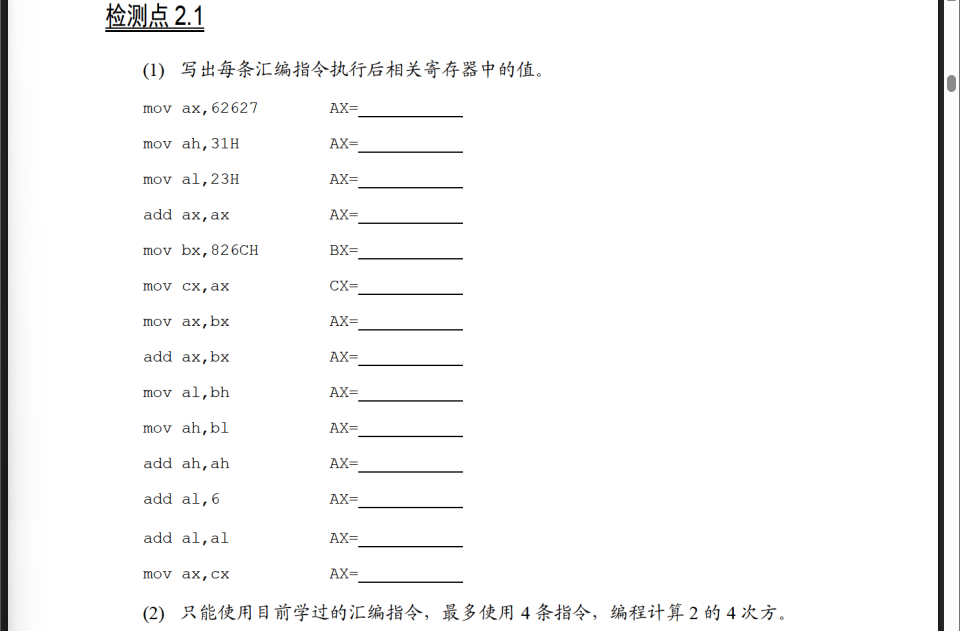

(1)

| 汇编指令 | AX | BX | CX |
| :------- | -- | -- | -- |
| `mov ax, 62627` | F4A3H |
| `mov ah, 31H` | 31A3H |
| `mov al, 23H` | 3123H |
| `add ax, ax` | 6246H |
| `mov bx, 826CH` | | 826CH |
| `mov cx, ax` | | | 6246H |
| `mov ax, bx` | 826CH |
| `add ax, bx` | 04D8H |
| `mov al, bh` | 0482H |
| `mov ah, bl` | 6C82H |
| `add ah, ah` | D882H |
| `add al, 6` | D888H |
| `add al, al` | D810H |
| `mov ax, cx` | 6246H |

(2)

```asm
mov ax, 2
add ax, ax
add ax, ax
add ax, ax
```